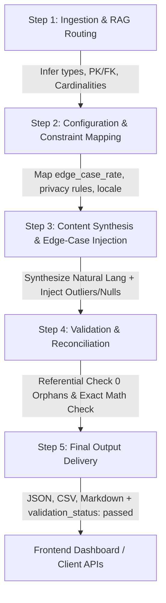

# HackDataV2 | Enterprise Synthetic Data Platform

High-performance AI Synthetic Data Generation Platform powered by **FastAPI**, **Gemini LLM Core Engine**, **Pandas**, **NumPy**, and **Supabase / PostgreSQL**.

---

## ⚡ Architecture & The 5-Step Pipeline



### The 5 Pipeline Steps:
1. **Step 1: Ingestion & RAG Routing**:
   - Parses incoming JSON schemas or raw sample data payloads.
   - Infers missing data types (UUIDs, currencies, emails, timestamps, addresses).
   - Establishes primary/foreign key mappings and cardinalities ($1:1$, $1:N$, $N:M$).
   - Automatically routes execution to **Tabular**, **Relational**, or **Document** pipelines.
2. **Step 2: Configuration & Constraint Mapping**:
   - Applies `row_count` / `document_volume`.
   - Configures `edge_case_rate` (controlled injection of nulls, statistical outliers, formatting anomalies).
   - Maps `privacy_controls` (column masking, SHA-256 hashing, differential privacy noise $\varepsilon$).
   - Injects `locale_settings` (currencies, date formats, regional tax rates).
3. **Step 3: Content Synthesis & Edge-Case Injection**:
   - Generates contextual, natural-language entity data (names, companies, addresses, line items).
   - Deliberately injects edge cases at the specified rate for adversarial testing.
   - Smooths arrays and matrices directly with **Pandas** and **NumPy**.
4. **Step 4: Validation & Reconciliation**:
   - **Relational Integrity Check**: Verifies that 100% of foreign keys in child tables resolve to valid parent table primary keys (0 orphan records).
   - **Document Mathematical Check**: Recalculates all item line totals ($\text{qty} \times \text{unit price}$), subtotals, tax brackets, discounts, and confirms zero variance against grand totals.
5. **Step 5: Final Output Delivery**:
   - Delivers structured JSON arrays and objects.
   - Sets `validation_status: "passed"`.
   - Produces regional Markdown and HTML layouts for document preview and export.

---

## 🚀 Quickstart

### 1. Install Dependencies
```bash
pip install -r requirements.txt
```

### 2. Configure Environment (.env)
```bash
cp .env.example .env
# Add your GEMINI_API_KEY (optional, fallback engine active if omitted)
# Add your SUPABASE_URL and SUPABASE_ANON_KEY
```

### 3. Launch the Platform
```bash
python -m uvicorn app.main:app --reload --host 127.0.0.1 --port 8000
```
- Interactive Web Dashboard: [http://127.0.0.1:8000](http://127.0.0.1:8000)
- OpenAPI / Swagger Docs: [http://127.0.0.1:8000/docs](http://127.0.0.1:8000/docs)

---

## 🧪 Running Automated Tests
```bash
python -m unittest discover tests
```

---

## 🛡️ Supabase Database Schema
Deploy the SQL schema in `app/db/schema.sql` to your Supabase / PostgreSQL instance:
- `profiles` with monthly quota tracking
- `api_keys` with SHA-256 secret hashing
- `user_schemas` with JSONB graph models
- `generation_jobs` with audit trails
- Row Level Security (RLS) policies for complete multi-tenant tenant isolation

---

## 📦 API Endpoints Overview

| Method | Endpoint | Description |
|---|---|---|
| `POST` | `/api/v1/generate` | Executes the complete 5-step synthetic pipeline |
| `POST` | `/api/v1/analyze-schema` | Step 1 Ingestion, type inference & RAG routing |
| `POST` | `/api/v1/export/{format}` | Exports datasets to `csv`, `json`, or `markdown` |
| `GET` | `/api/v1/templates` | Returns pre-built enterprise scenarios |
| `GET` | `/api/v1/health` | Engine status and Gemini integration health |

---

## 📜 License
MIT License &bull; HackDataV2 Synthetic Data Platform.
